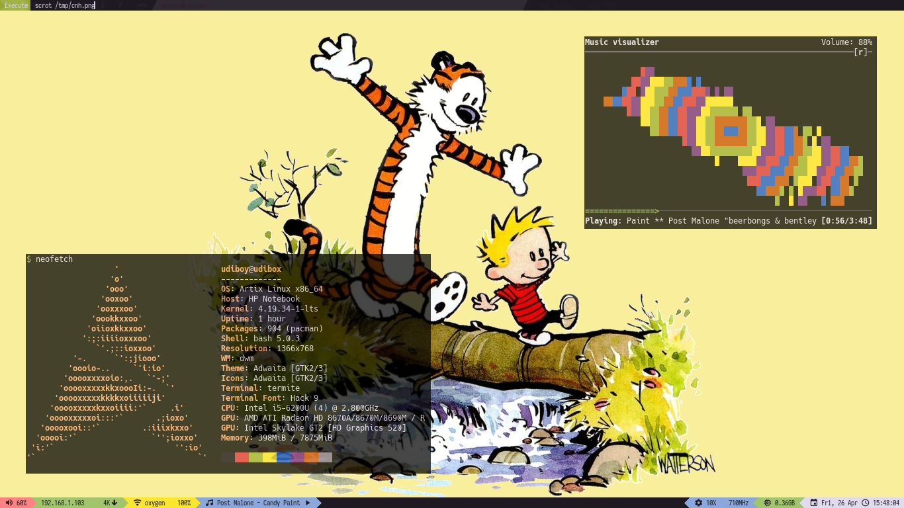

# Dotfiles repo

Collection of various dotfiles and configs, and tools to install and modify them



WM is dwm, with custom [patch](https://gist.github.com/udiboy1209/c4a47c3bb1bbfa5498032dee34bc144a).

## Installation

I have written two scripts `rclink` and `rcunlink` based on the functioning of
[GNU stow](https://www.gnu.org/software/stow/). They take a list of mappings from local dir
to home dir, and generate symlinks pretty much like how `stow` does.

### Usage

File `i3.set` contains lines like `wm/i3.conf : .config/i3/config`

```
$ tools/rclink linksets/i3.set
```

and to remove all symlinks

```
$ tools/rcunlink linksets/i3.set
```

## Templates

I have written a python script to use the [quik](https://github.com/avelino/quik) template engine,
and make my configs templated.

### Usage

The script `steamrice` takes input a YAML file containing a dict of values which will be replaced in template files.
I have essentially used it to quickly change colors.
It will scan current directory and run `quik` all `*.template` files, generating file with same name (minus `.template`) in the same folder.

```
$ tools/steamrice -t themes/get-fresh.yaml
```

If you have used `rclink`, then the changes will be seen directly.

*Note: be sure to add file and not its template to linkset*
